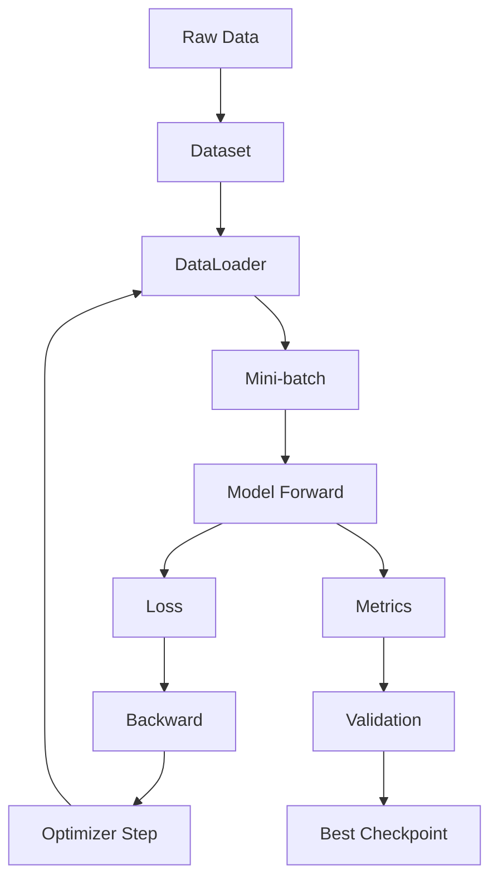

# Part 1: PyTorch Training Fundamentals

从训练原理到可复现实验。

这一章的目标不是学复杂模型，而是把深度学习项目最核心的训练闭环写熟：

```text
Dataset -> DataLoader -> Model -> Loss -> Backward -> Optimizer -> Evaluation -> Checkpoint -> Experiment Log
```

后面学 CNN、U-Net、DeepLabV3+、SegFormer、变化检测和遥感基础模型，本质上都是在这个闭环上换数据、换模型、换 loss、换指标。

---

## 1. 本章目标

学完后你应该能做到：

- 写自定义 `Dataset`
- 使用 `DataLoader` 组成 mini-batch
- 写一个最小 MLP 模型
- 写 `train_one_epoch` 和 `evaluate`
- 理解 `loss.backward()` 和 `optimizer.step()`
- 记录 loss 和 accuracy
- 做 learning rate 对比实验
- overfit 一小批数据，用来检查训练流程
- 保存 best checkpoint
- 写简单实验日志

---

## 2. 训练闭环图



核心循环：

```text
for epoch in range(num_epochs):
    train_one_epoch(...)
    evaluate(...)
    save best model
```

---

## 3. 基础概念

| 概念 | 含义 |
| --- | --- |
| sample | 一个训练样本 |
| batch | 一小组样本，一次送进模型 |
| iteration | 一次参数更新 |
| epoch | 模型完整看完一遍训练集 |

如果训练集有 1000 个样本，`batch_size=100`，那么：

```text
1 epoch = 10 iterations
```

遥感任务中，图像 patch 大、显存压力高，`batch_size` 经常很小，比如 2、4、8。

---

## 4. 准备环境和随机种子

```python
import random
from pathlib import Path

import torch
import torch.nn as nn
import torch.nn.functional as F
from torch.utils.data import Dataset, DataLoader, random_split


def set_seed(seed=42):
    """固定随机种子，提升实验可复现性。"""
    random.seed(seed)
    torch.manual_seed(seed)
    torch.cuda.manual_seed_all(seed)


set_seed(42)
device = torch.device("cuda" if torch.cuda.is_available() else "cpu")
print("device:", device)
```

说明：真实论文复现还要记录 Python、PyTorch、CUDA、驱动版本和代码 commit。

---

## 5. 构造一个可控 toy dataset

为了不依赖网络下载数据，这一章先用二维分类数据集。它虽然简单，但训练闭环和真实遥感任务一样。

```python
def make_toy_classification(n=1200, noise=0.15):
    """生成一个二维非线性二分类数据集。

    返回:
        X: [n, 2] float tensor
        y: [n] long tensor，类别 0/1
    """
    X = torch.randn(n, 2)
    radius = X[:, 0] ** 2 + X[:, 1] ** 2
    noisy_radius = radius + noise * torch.randn(n)
    y = (noisy_radius > 1.2).long()
    return X, y


X, y = make_toy_classification()
print(X.shape, y.shape)
print("class counts:", torch.bincount(y))
```

---

## 6. 自定义 Dataset 和 DataLoader

```python
class ToyClassificationDataset(Dataset):
    """把 tensor 包装成 PyTorch Dataset。"""

    def __init__(self, X, y):
        self.X = X.float()
        self.y = y.long()

    def __len__(self):
        """返回样本数量。"""
        return len(self.X)

    def __getitem__(self, idx):
        """返回第 idx 个样本。"""
        return self.X[idx], self.y[idx]


dataset = ToyClassificationDataset(X, y)
train_size = int(0.8 * len(dataset))
val_size = len(dataset) - train_size
train_dataset, val_dataset = random_split(
    dataset,
    [train_size, val_size],
    generator=torch.Generator().manual_seed(42),
)

train_loader = DataLoader(train_dataset, batch_size=64, shuffle=True)
val_loader = DataLoader(val_dataset, batch_size=256, shuffle=False)

xb, yb = next(iter(train_loader))
print("batch X:", xb.shape)
print("batch y:", yb.shape)
```

图像分类中，`xb` 通常是 `[B, C, H, W]`；分割任务中，`yb` 通常是 `[B, H, W]`。

---

## 7. 定义最小 MLP 模型

```python
class TinyMLPClassifier(nn.Module):
    """一个最小 MLP 二分类器。

    输入:
        x: [batch, 2]
    输出:
        logits: [batch, 2]
    """

    def __init__(self, in_dim=2, hidden_dim=32, num_classes=2):
        super().__init__()
        self.net = nn.Sequential(
            nn.Linear(in_dim, hidden_dim),
            nn.ReLU(),
            nn.Linear(hidden_dim, hidden_dim),
            nn.ReLU(),
            nn.Linear(hidden_dim, num_classes),
        )

    def forward(self, x):
        return self.net(x)


model = TinyMLPClassifier().to(device)
logits = model(xb.to(device))
print("logits:", logits.shape)
```

模型输出的是 `logits`，不是概率。分类训练时不要先手动 softmax 再传给 `F.cross_entropy`。

---

## 8. Loss 与 Accuracy

```python
def compute_accuracy(logits, targets):
    """计算分类准确率。"""
    preds = logits.argmax(dim=1)
    correct = (preds == targets).sum().item()
    total = targets.numel()
    return correct / total


loss = F.cross_entropy(logits, yb.to(device))
acc = compute_accuracy(logits, yb.to(device))
print("loss:", loss.item())
print("acc:", acc)
```

Cross entropy 的直觉：真实类别的预测概率越高，loss 越小。

---

## 9. 写 train_one_epoch

```python
def train_one_epoch(model, dataloader, optimizer, device):
    """训练一个 epoch，返回平均 loss 和 accuracy。"""
    model.train()
    total_loss = 0.0
    total_correct = 0
    total_count = 0

    for xb, yb in dataloader:
        xb = xb.to(device)
        yb = yb.to(device)

        logits = model(xb)
        loss = F.cross_entropy(logits, yb)

        optimizer.zero_grad(set_to_none=True)
        loss.backward()
        optimizer.step()

        batch_size = xb.size(0)
        total_loss += loss.item() * batch_size
        total_correct += (logits.argmax(dim=1) == yb).sum().item()
        total_count += batch_size

    return {"loss": total_loss / total_count, "acc": total_correct / total_count}
```

关键顺序：

```text
forward -> loss -> zero_grad -> backward -> step
```

---

## 10. 写 evaluate

```python
@torch.no_grad()
def evaluate(model, dataloader, device):
    """验证模型，不更新参数。"""
    model.eval()
    total_loss = 0.0
    total_correct = 0
    total_count = 0

    for xb, yb in dataloader:
        xb = xb.to(device)
        yb = yb.to(device)

        logits = model(xb)
        loss = F.cross_entropy(logits, yb)

        batch_size = xb.size(0)
        total_loss += loss.item() * batch_size
        total_correct += (logits.argmax(dim=1) == yb).sum().item()
        total_count += batch_size

    return {"loss": total_loss / total_count, "acc": total_correct / total_count}
```

验证时使用 `model.eval()` 和 `torch.no_grad()`，可以避免构建计算图并节省显存。

---

## 11. 完整训练函数

```python
def fit(model, train_loader, val_loader, optimizer, device, num_epochs=20):
    """完整训练流程，并记录每个 epoch 的指标。"""
    history = []
    best_val_acc = -1.0
    best_state = None

    for epoch in range(1, num_epochs + 1):
        train_metrics = train_one_epoch(model, train_loader, optimizer, device)
        val_metrics = evaluate(model, val_loader, device)

        row = {
            "epoch": epoch,
            "train_loss": train_metrics["loss"],
            "train_acc": train_metrics["acc"],
            "val_loss": val_metrics["loss"],
            "val_acc": val_metrics["acc"],
        }
        history.append(row)

        if val_metrics["acc"] > best_val_acc:
            best_val_acc = val_metrics["acc"]
            best_state = {k: v.detach().cpu().clone() for k, v in model.state_dict().items()}

        print(
            f"epoch {epoch:02d} | "
            f"train loss {row['train_loss']:.4f} acc {row['train_acc']:.3f} | "
            f"val loss {row['val_loss']:.4f} acc {row['val_acc']:.3f}"
        )

    if best_state is not None:
        model.load_state_dict(best_state)

    return history


set_seed(42)
model = TinyMLPClassifier().to(device)
optimizer = torch.optim.Adam(model.parameters(), lr=1e-3)
history = fit(model, train_loader, val_loader, optimizer, device, num_epochs=20)
```

---

## 12. 保存和加载 checkpoint

```python
def save_checkpoint(path, model, optimizer, history, extra=None):
    """保存模型、优化器和实验记录。"""
    path = Path(path)
    path.parent.mkdir(parents=True, exist_ok=True)
    torch.save(
        {
            "model_state_dict": model.state_dict(),
            "optimizer_state_dict": optimizer.state_dict(),
            "history": history,
            "extra": extra or {},
        },
        path,
    )


def load_checkpoint(path, model, optimizer=None, map_location="cpu"):
    """加载 checkpoint。"""
    checkpoint = torch.load(path, map_location=map_location)
    model.load_state_dict(checkpoint["model_state_dict"])
    if optimizer is not None:
        optimizer.load_state_dict(checkpoint["optimizer_state_dict"])
    return checkpoint


save_checkpoint(
    "outputs/checkpoints/tiny_mlp_best.pt",
    model,
    optimizer,
    history,
    extra={"dataset": "toy_classification", "lr": 1e-3},
)
```

---

## 13. Learning Rate 小实验

| learning rate | 常见现象 |
| --- | --- |
| 太小 | loss 降得很慢 |
| 合适 | loss 稳定下降 |
| 太大 | loss 震荡，甚至 NaN |

```python
def run_lr_experiment(lr_values=(1e-4, 1e-3, 1e-1), num_epochs=10):
    """比较不同 learning rate 的训练效果。"""
    results = {}
    for lr in lr_values:
        set_seed(42)
        model = TinyMLPClassifier().to(device)
        optimizer = torch.optim.Adam(model.parameters(), lr=lr)
        print("\nLR =", lr)
        history = fit(model, train_loader, val_loader, optimizer, device, num_epochs=num_epochs)
        results[lr] = history
    return results


lr_results = run_lr_experiment()
```

---

## 14. 画训练曲线

```python
import matplotlib.pyplot as plt


def plot_history(history, title="training curve"):
    """绘制 loss 和 accuracy 曲线。"""
    epochs = [row["epoch"] for row in history]
    train_loss = [row["train_loss"] for row in history]
    val_loss = [row["val_loss"] for row in history]
    train_acc = [row["train_acc"] for row in history]
    val_acc = [row["val_acc"] for row in history]

    fig, axes = plt.subplots(1, 2, figsize=(10, 4))
    axes[0].plot(epochs, train_loss, label="train")
    axes[0].plot(epochs, val_loss, label="val")
    axes[0].set_title("loss")
    axes[0].legend()

    axes[1].plot(epochs, train_acc, label="train")
    axes[1].plot(epochs, val_acc, label="val")
    axes[1].set_title("accuracy")
    axes[1].legend()

    fig.suptitle(title)
    plt.show()


plot_history(history, "TinyMLP on toy dataset")
```

---

## 15. Overfit 小数据集实验

如果模型不能 overfit 很小一批数据，通常说明数据、标签、loss、shape 或学习率有问题。

```python
def make_small_loader(dataset, n=32, batch_size=32):
    """取很小一部分数据，用来测试模型能不能 overfit。"""
    subset = torch.utils.data.Subset(dataset, list(range(n)))
    return DataLoader(subset, batch_size=batch_size, shuffle=True)


small_loader = make_small_loader(dataset, n=32)

set_seed(123)
small_model = TinyMLPClassifier(hidden_dim=64).to(device)
small_optimizer = torch.optim.Adam(small_model.parameters(), lr=1e-2)
small_history = fit(small_model, small_loader, small_loader, small_optimizer, device, num_epochs=30)
```

遥感迁移：训练 U-Net 时，先让模型 overfit 5 到 10 张遥感 patch，是检查 image/mask 是否对齐的最好办法。

---

## 16. 实验日志模板

```python
experiment_log = {
    "project": "part1_pytorch_training_fundamentals",
    "model": "TinyMLPClassifier",
    "dataset": "synthetic toy classification",
    "seed": 42,
    "optimizer": "Adam",
    "learning_rate": 1e-3,
    "batch_size": 64,
    "num_epochs": 20,
    "best_val_acc": max(row["val_acc"] for row in history),
}

experiment_log
```

---

## 17. 常见坑

| 问题 | 可能原因 | 排查方法 |
| --- | --- | --- |
| loss 不下降 | lr 太小/太大、标签错、模型没更新 | 打印梯度、overfit 小数据 |
| 训练 acc 高，验证 acc 低 | 过拟合 | 数据增强、正则化、更多数据 |
| 出现 NaN | lr 太大、除零、log(0)、混合精度不稳 | 降 lr、检查 loss、关 AMP |
| GPU 没用上 | tensor 或 model 没 `.to(device)` | 打印 `.device` |
| 验证结果波动 | batch 太小、数据太少、随机性 | 固定 seed，扩大验证集 |
| 分割 mask 错位 | 图像和 mask 增强不同步 | 可视化 image/mask overlay |

---

## 18. 遥感迁移

| 当前章节 | 遥感任务中对应 |
| --- | --- |
| `ToyClassificationDataset` | `RemoteSensingPatchDataset` |
| `X: [B, 2]` | `image: [B, C, H, W]` |
| `y: [B]` | 分类 `[B]` 或分割 `[B, H, W]` |
| `TinyMLPClassifier` | CNN / U-Net / DeepLabV3+ / SegFormer |
| `cross_entropy` | 分类 CE、分割 CE、Dice、Focal loss |
| `accuracy` | IoU、F1、mIoU、OA、Kappa |
| checkpoint | 论文复现实验权重 |

下一章进入 CNN 图像分类时，你会把输入从二维点变成图像：

```text
[B, 2] -> [B, C, H, W]
```

---

## 19. 作业

1. 把 `hidden_dim` 从 32 改成 8、64、128，对比结果。
2. 把 optimizer 从 Adam 改成 SGD，观察收敛速度。
3. 把 learning rate 改成 `1e-4`、`1e-3`、`1e-1`，画 loss 曲线。
4. 让模型 overfit 16 个样本，观察是否能达到接近 100% accuracy。
5. 把 `TinyMLPClassifier` 改成 3 层、4 层，对比是否更好。
6. 记录一次完整实验日志，写下你的观察。

---

## 20. 本章小结

这一章你真正要带走的是训练闭环：

```text
数据 -> batch -> 模型 -> loss -> 梯度 -> 更新 -> 验证 -> 保存 -> 记录
```

如果训练出问题，优先检查：

```text
shape
设备 device
loss
label
learning rate
overfit small batch
```
