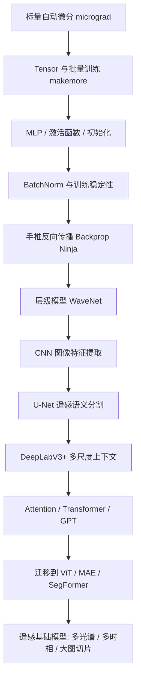
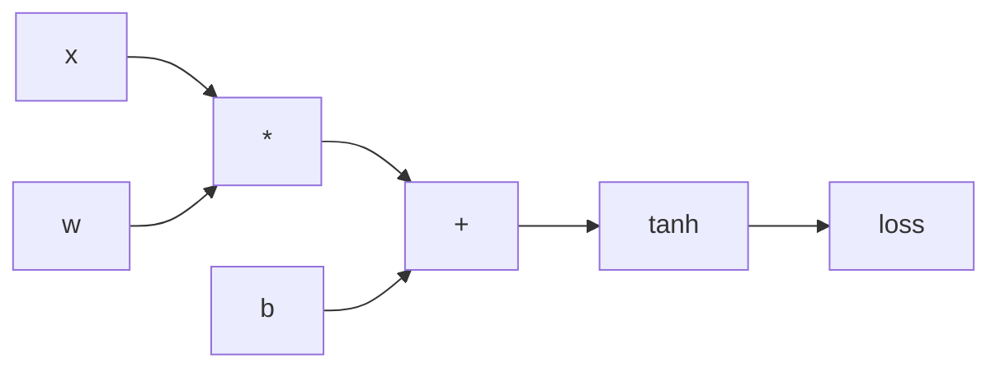
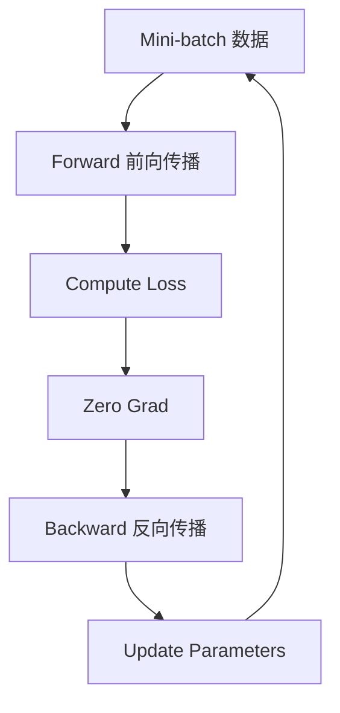
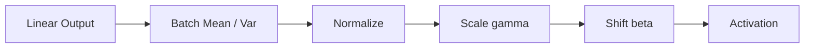
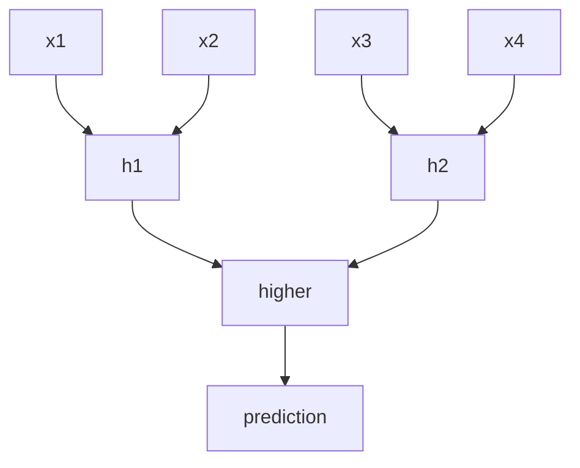
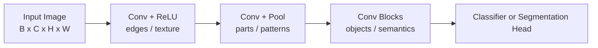
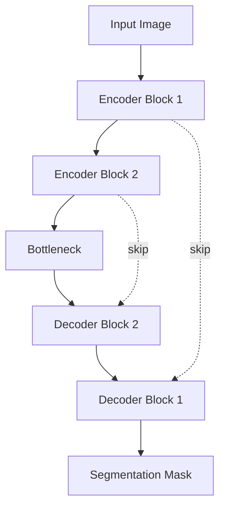
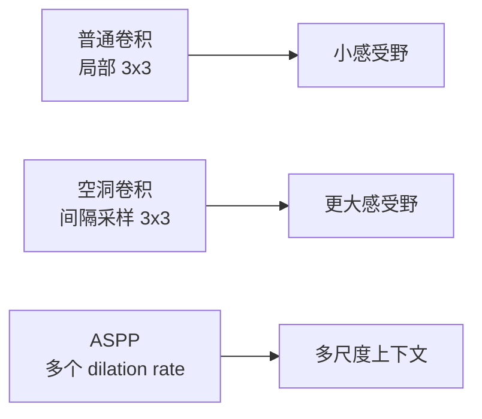
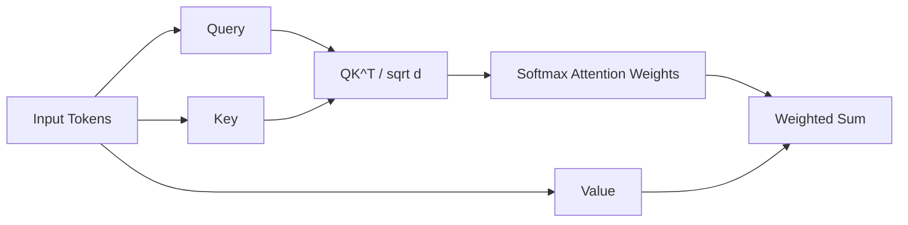
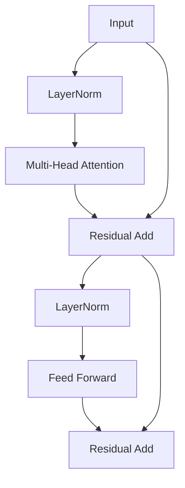

# 深度学习转码路线：Karpathy 底层原理 + CV / 遥感分割

面向目标：从“会调 PyTorch API”进阶到“理解神经网络底层原理，并能迁移到 CV / 遥感深度学习”。

这份路线以 Andrej Karpathy 的 `Neural Networks: Zero to Hero` 打底，但为地信遥感方向做了调整：在 `WaveNet` 和 `GPT from scratch` 之间插入 **CNN、U-Net、DeepLabV3+**。原因很简单：遥感科研更早接触的是图像分类、语义分割、变化检测和大幅面影像处理，图像分割会比语言模型更早派上用场。

调整后的路线：

1. `micrograd`：手写自动微分
2. `makemore part 1-3`：Tensor、训练循环、MLP、初始化、BatchNorm
3. `Backprop Ninja`：手推反向传播
4. `WaveNet`：卷积、层级结构、`torch.nn`
5. `CNN`：图像特征提取、卷积、池化、分类
6. `U-Net`：Encoder-Decoder、跳跃连接、遥感语义分割
7. `DeepLabV3+`：空洞卷积、ASPP、多尺度上下文
8. `GPT from scratch`：Transformer、Attention、训练框架

> 学习建议：每一节不要只看懂，要把演示函数自己敲一遍，并尝试改参数、打印中间变量、画 loss 曲线。

---

## 0. 总体知识地图



核心主线：

```text
前向传播：输入 -> 模型 -> loss
反向传播：loss -> 梯度 -> 参数更新
工程训练：batch -> optimizer -> validation -> checkpoint
结构升级：MLP -> CNN -> U-Net -> DeepLabV3+ -> Transformer -> 遥感基础模型
```

---

## 1. micrograd：手写自动微分

### 1.1 要掌握什么

`micrograd` 的重点不是做大模型，而是理解：

- 神经网络本质上是一个计算图
- 每个节点保存 `data` 和 `grad`
- 前向传播计算数值
- 反向传播按链式法则累积梯度
- 参数更新就是沿负梯度方向移动

### 1.2 计算图



如果：

```text
y = tanh(x * w + b)
```

那么梯度会从 `y` 反向流回 `x`、`w`、`b`。

### 1.3 演示函数：最小自动微分引擎

```python
import math


class Value:
    """一个标量节点，保存数值 data、梯度 grad 和反向传播函数。"""

    def __init__(self, data, _children=(), _op=""):
        self.data = data
        self.grad = 0.0
        self._prev = set(_children)
        self._op = _op
        self._backward = lambda: None

    def __add__(self, other):
        """加法节点：out = self + other。"""
        other = other if isinstance(other, Value) else Value(other)
        out = Value(self.data + other.data, (self, other), "+")

        def _backward():
            # d(self + other)/dself = 1
            # d(self + other)/dother = 1
            self.grad += 1.0 * out.grad
            other.grad += 1.0 * out.grad

        out._backward = _backward
        return out

    def __mul__(self, other):
        """乘法节点：out = self * other。"""
        other = other if isinstance(other, Value) else Value(other)
        out = Value(self.data * other.data, (self, other), "*")

        def _backward():
            # d(self * other)/dself = other
            # d(self * other)/dother = self
            self.grad += other.data * out.grad
            other.grad += self.data * out.grad

        out._backward = _backward
        return out

    def tanh(self):
        """双曲正切激活函数。"""
        t = math.tanh(self.data)
        out = Value(t, (self,), "tanh")

        def _backward():
            # d(tanh(x))/dx = 1 - tanh(x)^2
            self.grad += (1 - t * t) * out.grad

        out._backward = _backward
        return out

    def backward(self):
        """拓扑排序后，从输出节点反向传播到所有前驱节点。"""
        topo = []
        visited = set()

        def build_topo(v):
            if v not in visited:
                visited.add(v)
                for child in v._prev:
                    build_topo(child)
                topo.append(v)

        build_topo(self)
        self.grad = 1.0

        for node in reversed(topo):
            node._backward()

    def __repr__(self):
        return f"Value(data={self.data:.4f}, grad={self.grad:.4f})"
```

### 1.4 演示函数：单个神经元

```python
def demo_single_neuron():
    """演示一个神经元的前向传播和反向传播。"""
    x = Value(2.0)
    w = Value(-3.0)
    b = Value(1.0)

    # 前向传播：y = tanh(x * w + b)
    y = (x * w + b).tanh()

    # 反向传播：计算 dy/dx, dy/dw, dy/db
    y.backward()

    print("y:", y)
    print("x:", x)
    print("w:", w)
    print("b:", b)


demo_single_neuron()
```

你应该观察：

- `w.grad` 表示改变权重会如何影响输出
- 如果把 `loss` 接在输出后，参数就能根据 `loss.grad` 被更新
- 深度学习框架的自动微分，本质上就是大规模、更高效的这套机制

### 1.5 和 PyTorch 的关系

```python
import torch


def demo_torch_autograd():
    """用 PyTorch 复现上面的自动微分。"""
    x = torch.tensor(2.0, requires_grad=True)
    w = torch.tensor(-3.0, requires_grad=True)
    b = torch.tensor(1.0, requires_grad=True)

    y = torch.tanh(x * w + b)
    y.backward()

    print("y:", y.item())
    print("x.grad:", x.grad.item())
    print("w.grad:", w.grad.item())
    print("b.grad:", b.grad.item())
```

---

## 2. makemore part 1-3：Tensor、MLP、训练循环、初始化、BatchNorm

### 2.1 要掌握什么

`makemore` 的目标是从字符预测任务出发，理解现代训练流程：

- 数据如何编码成整数
- embedding 如何把离散 token 变成连续向量
- MLP 如何做非线性变换
- loss 如何度量预测错误
- optimizer 如何更新参数
- 初始化和 BatchNorm 为什么影响训练稳定性

### 2.2 训练循环图



### 2.3 演示函数：字符数据构造

```python
def build_char_dataset(words, block_size=3):
    """把单词列表转换成字符级语言模型训练数据。

    参数:
        words: 单词列表，例如 ["emma", "olivia"]
        block_size: 用前几个字符预测下一个字符

    返回:
        X: 输入上下文，形状 [N, block_size]
        Y: 目标字符，形状 [N]
        stoi / itos: 字符和整数的映射
    """
    import torch

    chars = sorted(list(set("".join(words))))
    stoi = {ch: i + 1 for i, ch in enumerate(chars)}
    stoi["."] = 0
    itos = {i: ch for ch, i in stoi.items()}

    X, Y = [], []
    for word in words:
        context = [0] * block_size
        for ch in word + ".":
            ix = stoi[ch]
            X.append(context)
            Y.append(ix)
            context = context[1:] + [ix]

    return torch.tensor(X), torch.tensor(Y), stoi, itos
```

### 2.4 演示函数：一个最小 MLP 字符模型

```python
import torch
import torch.nn.functional as F


def demo_mlp_char_model(words):
    """训练一个简化版 makemore MLP。

    重点看形状变化:
        X: [batch, block_size]
        emb: [batch, block_size, n_embd]
        hidden: [batch, n_hidden]
        logits: [batch, vocab_size]
    """
    X, Y, stoi, itos = build_char_dataset(words, block_size=3)
    vocab_size = len(stoi)

    n_embd = 10
    n_hidden = 64
    block_size = 3

    # C 是 embedding table，每个字符 id 对应一个向量
    C = torch.randn(vocab_size, n_embd) * 0.1

    # 第一层：把 3 个字符 embedding 拼接后输入 MLP
    W1 = torch.randn(block_size * n_embd, n_hidden) * (5 / 3) / (block_size * n_embd) ** 0.5
    b1 = torch.zeros(n_hidden)

    # 输出层：预测下一个字符
    W2 = torch.randn(n_hidden, vocab_size) * 0.01
    b2 = torch.zeros(vocab_size)

    parameters = [C, W1, b1, W2, b2]
    for p in parameters:
        p.requires_grad = True

    for step in range(200):
        # 随机采样 mini-batch
        ix = torch.randint(0, X.shape[0], (32,))
        xb, yb = X[ix], Y[ix]

        # 前向传播
        emb = C[xb]
        h = torch.tanh(emb.view(emb.shape[0], -1) @ W1 + b1)
        logits = h @ W2 + b2
        loss = F.cross_entropy(logits, yb)

        # 反向传播
        for p in parameters:
            p.grad = None
        loss.backward()

        # 参数更新
        lr = 0.1 if step < 100 else 0.01
        for p in parameters:
            p.data += -lr * p.grad

        if step % 50 == 0:
            print(step, loss.item())

    return parameters, stoi, itos
```

### 2.5 初始化为什么重要

如果初始化太大：

```text
激活值过大 -> tanh 饱和 -> 梯度接近 0 -> 学不动
```

如果初始化太小：

```text
信号太弱 -> 层间方差越来越小 -> 训练慢
```

推荐记住：

```text
ReLU / GELU 常用 Kaiming 初始化
tanh 常用 Xavier 或带 gain 的初始化
输出层初始值可以小一点，避免初始 logits 过度自信
```

### 2.6 BatchNorm 的直觉

BatchNorm 做的事情：

```text
每个 batch 内:
    1. 减去均值
    2. 除以标准差
    3. 再乘 gamma，加 beta
```



演示函数：

```python
def batchnorm_forward(x, gamma, beta, eps=1e-5):
    """手写 BatchNorm 前向传播。

    x: [batch, features]
    gamma: 可学习缩放参数
    beta: 可学习平移参数
    """
    mean = x.mean(dim=0, keepdim=True)
    var = x.var(dim=0, keepdim=True, unbiased=False)
    x_hat = (x - mean) / torch.sqrt(var + eps)
    out = gamma * x_hat + beta
    return out
```

迁移到 CV / 遥感时要注意：

- 小 batch 时 BatchNorm 不稳定，可以考虑 GroupNorm / LayerNorm
- 遥感大图切片训练 batch 往往较小，这个问题很常见
- Transformer 更常用 LayerNorm

---

## 3. Backprop Ninja：手推反向传播

### 3.1 要掌握什么

这一节的核心不是背公式，而是做到：

- 知道每个中间变量的梯度来自哪里
- 能检查 PyTorch 自动求导是否合理
- 能定位 NaN、梯度爆炸、梯度消失
- 能写自定义 loss 或自定义层

### 3.2 反向传播基本规则

```text
z = x + y
dz/dx = 1
dz/dy = 1

z = x * y
dz/dx = y
dz/dy = x

z = tanh(x)
dz/dx = 1 - tanh(x)^2

z = exp(x)
dz/dx = exp(x)
```

链式法则：

```text
dL/dx = dL/dz * dz/dx
```

### 3.3 演示函数：手写 softmax cross entropy

```python
def manual_cross_entropy(logits, targets):
    """手写 cross entropy，展示从 logits 到 loss 的过程。

    logits: [batch, num_classes]
    targets: [batch]
    """
    # 数值稳定技巧：减去每行最大值，避免 exp 溢出
    logits_stable = logits - logits.max(dim=1, keepdim=True).values

    counts = logits_stable.exp()
    probs = counts / counts.sum(dim=1, keepdim=True)

    # 取出真实类别的概率
    batch_indices = torch.arange(logits.shape[0])
    correct_probs = probs[batch_indices, targets]

    # cross entropy = -log p(correct class)
    loss = -correct_probs.log().mean()
    return loss
```

### 3.4 演示函数：梯度检查

```python
def gradient_check_scalar(f, x, eps=1e-6):
    """用有限差分检查标量函数的梯度。

    f: 输入 tensor，输出标量 loss
    x: 需要检查梯度的 tensor
    """
    x = x.clone().detach().requires_grad_(True)
    loss = f(x)
    loss.backward()
    autograd_grad = x.grad.clone()

    numerical_grad = torch.zeros_like(x)
    flat_x = x.detach().clone().view(-1)
    flat_grad = numerical_grad.view(-1)

    for i in range(flat_x.numel()):
        old = flat_x[i].item()

        flat_x[i] = old + eps
        loss_pos = f(flat_x.view_as(x)).item()

        flat_x[i] = old - eps
        loss_neg = f(flat_x.view_as(x)).item()

        flat_x[i] = old
        flat_grad[i] = (loss_pos - loss_neg) / (2 * eps)

    return autograd_grad, numerical_grad
```

在遥感模型里，你很少手写完整 backward，但你会经常需要检查：

- 自定义 loss 是否梯度正常
- dice loss / focal loss 是否数值稳定
- 多任务 loss 的权重是否导致某个任务梯度过大
- 混合精度训练是否产生 NaN

---

## 4. WaveNet：卷积、层级结构、`torch.nn`

### 4.1 要掌握什么

WaveNet 这部分可以帮你理解：

- 为什么局部上下文可以逐层扩大
- 为什么层级结构比单层 MLP 更高效
- `torch.nn.Module` 如何组织模型
- embedding、linear、norm、activation 如何组合

虽然 WaveNet 原本是序列模型，但它对 CV 很重要，因为 CNN 和遥感大图理解也依赖层级感受野。

### 4.2 感受野扩大图




### 4.3 演示函数：用 `nn.Module` 写 MLP

```python
import torch.nn as nn


class TinyMLP(nn.Module):
    """一个最小 MLP，用来理解 torch.nn.Module 的写法。"""

    def __init__(self, in_dim, hidden_dim, out_dim):
        super().__init__()
        self.net = nn.Sequential(
            nn.Linear(in_dim, hidden_dim),
            nn.Tanh(),
            nn.Linear(hidden_dim, out_dim),
        )

    def forward(self, x):
        return self.net(x)
```

### 4.4 演示函数：一维层级卷积

```python
class TinyCausalConvNet(nn.Module):
    """一个简化的序列卷积模型，用来理解局部上下文聚合。

    对 CV 来说，可以把 Conv1d 类比为 Conv2d：
    - Conv1d 处理序列
    - Conv2d 处理图像
    - 层数越深，感受野越大
    """

    def __init__(self, vocab_size, emb_dim=32, hidden_dim=64):
        super().__init__()
        self.embedding = nn.Embedding(vocab_size, emb_dim)
        self.conv = nn.Sequential(
            nn.Conv1d(emb_dim, hidden_dim, kernel_size=3, padding=1),
            nn.ReLU(),
            nn.Conv1d(hidden_dim, hidden_dim, kernel_size=3, padding=1),
            nn.ReLU(),
        )
        self.head = nn.Linear(hidden_dim, vocab_size)

    def forward(self, x):
        # x: [batch, time]
        emb = self.embedding(x)

        # Conv1d 需要 [batch, channels, time]
        h = emb.transpose(1, 2)
        h = self.conv(h)

        # 转回 [batch, time, channels]
        h = h.transpose(1, 2)
        logits = self.head(h)
        return logits
```

### 4.5 迁移到 CV 和遥感

对应关系：

| WaveNet / 序列 | CV / 遥感 |
| --- | --- |
| token 序列 | 图像 patch / 像素 / 时间序列 |
| Conv1d | Conv2d / Conv3d |
| 局部上下文 | 空间邻域 / 多时相邻域 |
| 感受野 | 地物上下文范围 |
| 层级特征 | 低层纹理 -> 高层语义 |

遥感常见问题：

- 目标尺度差异大：建筑、道路、农田、城市块尺度不同
- 大图切片会丢上下文：需要多尺度或更大感受野
- 多时相数据可看成时间序列：可用 1D temporal conv、RNN、Transformer

---

## 5. CNN：图像特征提取的基本功

### 5.1 为什么在这里插入 CNN

Karpathy 的路线从 WaveNet 进入 GPT 很自然，但你是遥感方向，必须先把图像模型吃透。CNN 是 U-Net、DeepLabV3+、ResNet、遥感分割和变化检测的共同地基。

你要掌握：

- 卷积核如何提取局部模式
- channel、height、width 的张量形状
- padding、stride、pooling 如何改变分辨率
- 感受野如何随层数扩大
- backbone 如何从低级纹理走向高级语义

### 5.2 CNN 特征层级图



### 5.3 演示函数：最小 CNN 分类器

```python
import torch
import torch.nn as nn


class TinyCNN(nn.Module):
    """一个最小 CNN，用来理解图像分类中的张量形状变化。

    输入:
        x: [batch, in_channels, height, width]
    输出:
        logits: [batch, num_classes]
    """

    def __init__(self, in_channels=3, num_classes=10):
        super().__init__()
        self.features = nn.Sequential(
            nn.Conv2d(in_channels, 32, kernel_size=3, padding=1),
            nn.BatchNorm2d(32),
            nn.ReLU(inplace=True),
            nn.MaxPool2d(kernel_size=2),  # H, W 变为原来的一半

            nn.Conv2d(32, 64, kernel_size=3, padding=1),
            nn.BatchNorm2d(64),
            nn.ReLU(inplace=True),
            nn.MaxPool2d(kernel_size=2),
        )
        self.classifier = nn.Sequential(
            nn.AdaptiveAvgPool2d((1, 1)),  # 不管输入多大，都汇聚成 1x1
            nn.Flatten(),
            nn.Linear(64, num_classes),
        )

    def forward(self, x):
        x = self.features(x)
        logits = self.classifier(x)
        return logits
```

### 5.4 演示函数：打印 CNN 中间形状

```python
def demo_cnn_shapes():
    """观察 CNN 每一层如何改变 feature map 形状。"""
    model = TinyCNN(in_channels=3, num_classes=10)
    x = torch.randn(2, 3, 128, 128)

    print("input:", x.shape)
    for layer in model.features:
        x = layer(x)
        print(layer.__class__.__name__, "->", x.shape)
```

### 5.5 遥感迁移重点

| CNN 概念 | 遥感中的意义 |
| --- | --- |
| channel | RGB、多光谱、高光谱波段 |
| feature map | 建筑、道路、农田、水体等空间响应 |
| pooling / stride | 降低分辨率，但可能损失小目标 |
| receptive field | 模型能看到多大范围的地物上下文 |
| BatchNorm | 小 batch 遥感训练时可能不稳定 |

遥感注意点：

- 遥感小目标多，过度下采样会丢建筑、道路、田埂等细节
- 大图切片会破坏全局上下文，需要重叠切片或多尺度策略
- 多光谱输入不能简单照搬 ImageNet RGB 权重，需要适配第一层卷积

---

## 6. U-Net：遥感语义分割的入门核心

### 6.1 要掌握什么

U-Net 是遥感分割最重要的入门模型之一，适合建筑物提取、道路提取、水体提取、土地覆盖分割。

核心概念：

- Encoder：逐步下采样，提取高级语义
- Decoder：逐步上采样，恢复空间分辨率
- Skip Connection：把浅层细节传给解码器
- Pixel-wise prediction：每个像素输出一个类别

### 6.2 U-Net 结构图



### 6.3 演示函数：U-Net 基础模块

```python
class DoubleConv(nn.Module):
    """U-Net 中常用的 Conv-BN-ReLU x 2 模块。"""

    def __init__(self, in_channels, out_channels):
        super().__init__()
        self.net = nn.Sequential(
            nn.Conv2d(in_channels, out_channels, kernel_size=3, padding=1),
            nn.BatchNorm2d(out_channels),
            nn.ReLU(inplace=True),
            nn.Conv2d(out_channels, out_channels, kernel_size=3, padding=1),
            nn.BatchNorm2d(out_channels),
            nn.ReLU(inplace=True),
        )

    def forward(self, x):
        return self.net(x)
```

### 6.4 演示函数：迷你 U-Net

```python
class MiniUNet(nn.Module):
    """一个小型 U-Net，用来跑通遥感二分类或多分类分割。

    输入:
        x: [B, C, H, W]
    输出:
        logits: [B, num_classes, H, W]
    """

    def __init__(self, in_channels=3, num_classes=2):
        super().__init__()
        self.enc1 = DoubleConv(in_channels, 32)
        self.pool1 = nn.MaxPool2d(2)
        self.enc2 = DoubleConv(32, 64)
        self.pool2 = nn.MaxPool2d(2)

        self.bottleneck = DoubleConv(64, 128)

        self.up2 = nn.ConvTranspose2d(128, 64, kernel_size=2, stride=2)
        self.dec2 = DoubleConv(128, 64)
        self.up1 = nn.ConvTranspose2d(64, 32, kernel_size=2, stride=2)
        self.dec1 = DoubleConv(64, 32)

        self.head = nn.Conv2d(32, num_classes, kernel_size=1)

    def forward(self, x):
        e1 = self.enc1(x)
        e2 = self.enc2(self.pool1(e1))

        b = self.bottleneck(self.pool2(e2))

        d2 = self.up2(b)
        d2 = torch.cat([d2, e2], dim=1)  # 拼接深层语义和浅层细节
        d2 = self.dec2(d2)

        d1 = self.up1(d2)
        d1 = torch.cat([d1, e1], dim=1)
        d1 = self.dec1(d1)

        return self.head(d1)
```

### 6.5 演示函数：分割指标 IoU

```python
def mean_iou(pred, target, num_classes, eps=1e-6):
    """计算 mean IoU。

    pred: [B, H, W]，预测类别 id
    target: [B, H, W]，真实类别 id
    """
    ious = []
    for cls in range(num_classes):
        pred_cls = pred == cls
        target_cls = target == cls
        intersection = (pred_cls & target_cls).sum().float()
        union = (pred_cls | target_cls).sum().float()
        ious.append((intersection + eps) / (union + eps))
    return torch.stack(ious).mean()
```

### 6.6 遥感迁移重点

| U-Net 概念 | 遥感中的意义 |
| --- | --- |
| Encoder | 获取大范围语义上下文 |
| Decoder | 恢复像素级边界 |
| Skip connection | 保留建筑边缘、道路细线、水体边界 |
| Dice / IoU | 常用分割指标 |
| Class imbalance | 建筑/道路像素可能远少于背景 |

建议练习：

```text
1. 用 MiniUNet overfit 10 张 image/mask，确认训练闭环正确
2. 加 IoU / F1 指标
3. 保存 best checkpoint
4. 输出预测 mask 可视化
5. 替换为真实遥感建筑物或水体数据集
```

---

## 7. DeepLabV3+：多尺度上下文和空洞卷积

### 7.1 为什么学 DeepLabV3+

U-Net 很适合入门，但遥感图像里地物尺度差异很大：小建筑、宽道路、大片农田、水体、城市街区同时存在。DeepLabV3+ 的价值在于学习多尺度上下文。

核心概念：

- Atrous / Dilated Convolution：扩大感受野但不降低分辨率
- ASPP：用多个 dilation rate 捕获多尺度信息
- Encoder-Decoder：兼顾语义和边界
- Backbone：通常使用 ResNet / Xception / MobileNet 等

### 7.2 空洞卷积直觉



### 7.3 演示函数：ASPP 模块

```python
class ASPP(nn.Module):
    """简化版 Atrous Spatial Pyramid Pooling。

    多个不同 dilation rate 的卷积分支并行提取多尺度上下文。
    """

    def __init__(self, in_channels, out_channels, rates=(1, 6, 12, 18)):
        super().__init__()
        branches = []
        for rate in rates:
            branches.append(
                nn.Sequential(
                    nn.Conv2d(
                        in_channels,
                        out_channels,
                        kernel_size=3 if rate > 1 else 1,
                        padding=rate if rate > 1 else 0,
                        dilation=rate,
                        bias=False,
                    ),
                    nn.BatchNorm2d(out_channels),
                    nn.ReLU(inplace=True),
                )
            )
        self.branches = nn.ModuleList(branches)
        self.project = nn.Sequential(
            nn.Conv2d(out_channels * len(rates), out_channels, kernel_size=1),
            nn.BatchNorm2d(out_channels),
            nn.ReLU(inplace=True),
        )

    def forward(self, x):
        feats = [branch(x) for branch in self.branches]
        x = torch.cat(feats, dim=1)
        return self.project(x)
```

### 7.4 演示函数：迷你 DeepLab Head

```python
class MiniDeepLabHead(nn.Module):
    """简化版 DeepLabV3+ head。

    实际 DeepLabV3+ 会接一个更强的 backbone，并融合低层特征。
    这里先理解 ASPP -> 分类头的主线。
    """

    def __init__(self, in_channels=128, num_classes=2):
        super().__init__()
        self.aspp = ASPP(in_channels, 64)
        self.classifier = nn.Conv2d(64, num_classes, kernel_size=1)

    def forward(self, x, output_size):
        x = self.aspp(x)
        logits = self.classifier(x)

        # 上采样回原图大小，用于像素级监督
        logits = torch.nn.functional.interpolate(
            logits,
            size=output_size,
            mode="bilinear",
            align_corners=False,
        )
        return logits
```

### 7.5 遥感迁移重点

| DeepLabV3+ 概念 | 遥感中的意义 |
| --- | --- |
| 空洞卷积 | 不丢分辨率地扩大感受野 |
| ASPP | 同时识别小建筑和大片地物 |
| Backbone | 可替换成 ResNet、Swin、SegFormer encoder |
| Output stride | 控制速度、显存、细节之间的平衡 |
| 多尺度上下文 | 对土地覆盖、城市区域、农田块很重要 |

建议练习：

```text
1. 先用 torchvision 的 DeepLabV3 跑普通分割数据
2. 再用遥感二分类数据跑建筑/水体提取
3. 对比 U-Net 和 DeepLabV3+ 的边界质量和大目标识别
4. 记录不同 crop size、output stride、dilation rate 的影响
```

---

## 8. GPT from scratch：Transformer、Attention、训练框架

### 8.1 要掌握什么

这一节对遥感也非常重要，因为现代遥感基础模型大量使用 Transformer / ViT / MAE / CLIP 思路。

核心概念：

- token embedding
- position embedding
- self-attention
- multi-head attention
- residual connection
- layer normalization
- feed-forward network
- autoregressive training

### 8.2 Attention 图



直觉：

```text
Query: 我想找什么信息？
Key: 我有什么信息标签？
Value: 真正被取走的信息内容
```

### 8.3 演示函数：单头 Self-Attention

```python
class SelfAttention(nn.Module):
    """单头 self-attention。

    输入:
        x: [batch, tokens, channels]
    输出:
        out: [batch, tokens, head_size]
    """

    def __init__(self, channels, head_size):
        super().__init__()
        self.key = nn.Linear(channels, head_size, bias=False)
        self.query = nn.Linear(channels, head_size, bias=False)
        self.value = nn.Linear(channels, head_size, bias=False)

    def forward(self, x):
        B, T, C = x.shape

        k = self.key(x)
        q = self.query(x)
        v = self.value(x)

        # 注意力分数: [B, T, T]
        scores = q @ k.transpose(-2, -1) * (k.shape[-1] ** -0.5)

        # 每个 token 对其他 token 的关注权重
        weights = torch.softmax(scores, dim=-1)

        # 聚合 value
        out = weights @ v
        return out
```

### 8.4 演示函数：Causal Attention

GPT 需要保证当前位置不能看未来。

```python
class CausalSelfAttention(nn.Module):
    """带因果 mask 的 self-attention，用于 GPT。"""

    def __init__(self, channels, head_size, block_size):
        super().__init__()
        self.key = nn.Linear(channels, head_size, bias=False)
        self.query = nn.Linear(channels, head_size, bias=False)
        self.value = nn.Linear(channels, head_size, bias=False)
        self.register_buffer("tril", torch.tril(torch.ones(block_size, block_size)))

    def forward(self, x):
        B, T, C = x.shape

        k = self.key(x)
        q = self.query(x)
        v = self.value(x)

        scores = q @ k.transpose(-2, -1) * (k.shape[-1] ** -0.5)

        # 把未来位置 mask 成 -inf，softmax 后权重接近 0
        scores = scores.masked_fill(self.tril[:T, :T] == 0, float("-inf"))
        weights = torch.softmax(scores, dim=-1)

        return weights @ v
```

### 8.5 Transformer Block



演示代码：

```python
class FeedForward(nn.Module):
    """Transformer 中的逐 token MLP。"""

    def __init__(self, channels):
        super().__init__()
        self.net = nn.Sequential(
            nn.Linear(channels, 4 * channels),
            nn.GELU(),
            nn.Linear(4 * channels, channels),
        )

    def forward(self, x):
        return self.net(x)


class TransformerBlock(nn.Module):
    """简化版 Transformer block。"""

    def __init__(self, channels, head_size, block_size):
        super().__init__()
        self.ln1 = nn.LayerNorm(channels)
        self.attn = CausalSelfAttention(channels, head_size, block_size)
        self.proj = nn.Linear(head_size, channels)
        self.ln2 = nn.LayerNorm(channels)
        self.ffn = FeedForward(channels)

    def forward(self, x):
        x = x + self.proj(self.attn(self.ln1(x)))
        x = x + self.ffn(self.ln2(x))
        return x
```

### 8.6 和 ViT / 遥感基础模型的关系

GPT 和 ViT 的共同点：

```text
都是把输入切成 token
都用 self-attention 建模 token 间关系
都依赖 position embedding
都用 Transformer block 堆叠
```

区别：

| GPT | ViT / 遥感基础模型 |
| --- | --- |
| token 是文字 | token 是 image patch |
| causal mask，只看过去 | 通常双向 attention，可看全部 patch |
| 预测下一个 token | 分类、分割、重建、对比学习 |
| 文本序列 | 空间影像、多光谱、多时相 |

遥感迁移重点：

- RGB 3 通道变成多光谱/高光谱多通道
- 固定分辨率图像变成多尺度大幅面影像
- 位置编码需要考虑地理位置、时间、传感器
- 预训练任务可以是 masked image modeling、时相预测、跨模态对齐

---

## 9. 从底层原理迁移到 CV / 遥感深度学习

### 9.1 你要形成的能力

学完这一阶段，你应该能做到：

- 看懂 `loss.backward()` 背后发生了什么
- 手写一个完整训练循环
- 理解模型不收敛时该查哪里
- 理解 CNN、U-Net、DeepLabV3+ 和 Transformer 的基本结构
- 能跑通一个遥感语义分割 baseline
- 看遥感基础模型论文时不被公式吓住

### 9.2 对应到遥感任务

| 阶段 1 知识 | 遥感中的用途 |
| --- | --- |
| 自动微分 | 自定义损失函数、调试梯度 |
| 训练循环 | 复现论文 baseline |
| 初始化 | 稳定训练 U-Net / SegFormer / ViT |
| BatchNorm / LayerNorm | 小 batch、大图切片、多 GPU 训练 |
| CNN / 卷积层级结构 | 建筑物、道路、农田等空间特征提取 |
| U-Net | 建筑物、水体、道路、土地覆盖语义分割 |
| DeepLabV3+ | 多尺度地物识别和上下文建模 |
| Attention | 长距离上下文、多时相关系、基础模型 |
| Transformer block | ViT、Swin、MAE、CLIP、遥感 VLM |

### 9.3 推荐练习顺序

```text
1. 手写 Value 自动微分
2. 用 PyTorch 复现同样梯度
3. 写字符级 MLP 训练循环
4. 加 BatchNorm，对比 loss 曲线
5. 手写 cross entropy，和 F.cross_entropy 对比
6. 写 TinyMLP / TinyCausalConvNet
7. 写 TinyCNN 跑 CIFAR10 或 EuroSAT
8. 写 MiniUNet 跑建筑物/水体分割
9. 写 ASPP，理解 DeepLabV3+ 多尺度上下文
10. 写 SelfAttention，理解 Transformer
11. 把训练框架迁移到 SegFormer / ViT / 遥感基础模型
```

---

## 10. 一个最小训练框架模板

这是之后做 CV / 遥感实验时最常用的骨架。

```python
def train_one_epoch(model, dataloader, optimizer, device):
    """训练一个 epoch。"""
    model.train()
    total_loss = 0.0

    for images, targets in dataloader:
        images = images.to(device)
        targets = targets.to(device)

        # 前向传播
        outputs = model(images)
        loss = torch.nn.functional.cross_entropy(outputs, targets)

        # 清空旧梯度
        optimizer.zero_grad(set_to_none=True)

        # 反向传播
        loss.backward()

        # 参数更新
        optimizer.step()

        total_loss += loss.item() * images.size(0)

    return total_loss / len(dataloader.dataset)


@torch.no_grad()
def evaluate(model, dataloader, device):
    """验证模型。"""
    model.eval()
    total_loss = 0.0
    total_correct = 0
    total_count = 0

    for images, targets in dataloader:
        images = images.to(device)
        targets = targets.to(device)

        outputs = model(images)
        loss = torch.nn.functional.cross_entropy(outputs, targets)

        preds = outputs.argmax(dim=1)
        total_correct += (preds == targets).sum().item()
        total_count += targets.numel()
        total_loss += loss.item() * images.size(0)

    return {
        "loss": total_loss / len(dataloader.dataset),
        "acc": total_correct / total_count,
    }
```

---

## 11. 学习检查清单

### micrograd

- [ ] 能解释 `data` 和 `grad`
- [ ] 能解释 `_backward`
- [ ] 能解释拓扑排序为什么必要
- [ ] 能用 PyTorch 复现同样梯度

### makemore

- [ ] 能构造字符级数据集
- [ ] 能解释 embedding 的形状
- [ ] 能写 MLP 前向传播
- [ ] 能写训练循环
- [ ] 能解释初始化对训练的影响
- [ ] 能手写 BatchNorm 前向传播

### Backprop Ninja

- [ ] 能手写 softmax cross entropy
- [ ] 能用有限差分做梯度检查
- [ ] 能定位 NaN / 梯度爆炸 / 梯度消失

### WaveNet

- [ ] 能解释感受野
- [ ] 能写 `nn.Module`
- [ ] 能解释 Conv1d 和 Conv2d 的关系
- [ ] 能把层级结构迁移到图像任务

### CNN

- [ ] 能解释 `B x C x H x W`
- [ ] 能写 `Conv2d + BatchNorm2d + ReLU`
- [ ] 能解释 padding、stride、pooling
- [ ] 能打印每层 feature map 形状
- [ ] 能跑通一个图像分类训练循环

### U-Net

- [ ] 能解释 Encoder-Decoder
- [ ] 能解释 skip connection 为什么保留边界细节
- [ ] 能写 `DoubleConv`
- [ ] 能写一个小型 U-Net
- [ ] 能计算 IoU / F1
- [ ] 能 overfit 10 张遥感 image/mask

### DeepLabV3+

- [ ] 能解释空洞卷积
- [ ] 能解释 ASPP 的多尺度作用
- [ ] 能写简化版 ASPP
- [ ] 能比较 U-Net 和 DeepLabV3+ 的适用场景
- [ ] 能说明 output stride 对分辨率和显存的影响

### GPT from scratch

- [ ] 能解释 Q / K / V
- [ ] 能写单头 self-attention
- [ ] 能解释 causal mask
- [ ] 能画出 Transformer block
- [ ] 能说明 GPT 和 ViT 的区别

---

## 12. 下一步：连接到你的遥感路线

学完这份文档后，建议马上做三个小项目：

1. `pytorch-cifar10-from-scratch`
   - 目标：熟悉训练框架、CNN、可视化 loss
2. `unet-building-segmentation`
   - 目标：进入遥感语义分割
3. `deeplabv3plus-landcover-segmentation`
   - 目标：学习多尺度上下文和土地覆盖分割
4. `tiny-vit-remote-sensing`
   - 目标：把 GPT/Transformer 思路迁移到图像 patch

最终路线：

```text
Karpathy 底层原理
-> PyTorch 训练框架
-> CNN / U-Net / DeepLabV3+
-> Transformer / ViT / SegFormer
-> 遥感分割 / 变化检测 / 多时相建模
-> 遥感基础模型论文复现
-> 提出自己的创新点
```
